

    Twitter Clone Using MERN

<ul>
<!-- auth -->
    <li>
    AUTH ROUTERS
    <ul>
    <!-- signup -->
        <li>
        Signup
            <ul>
                <li>password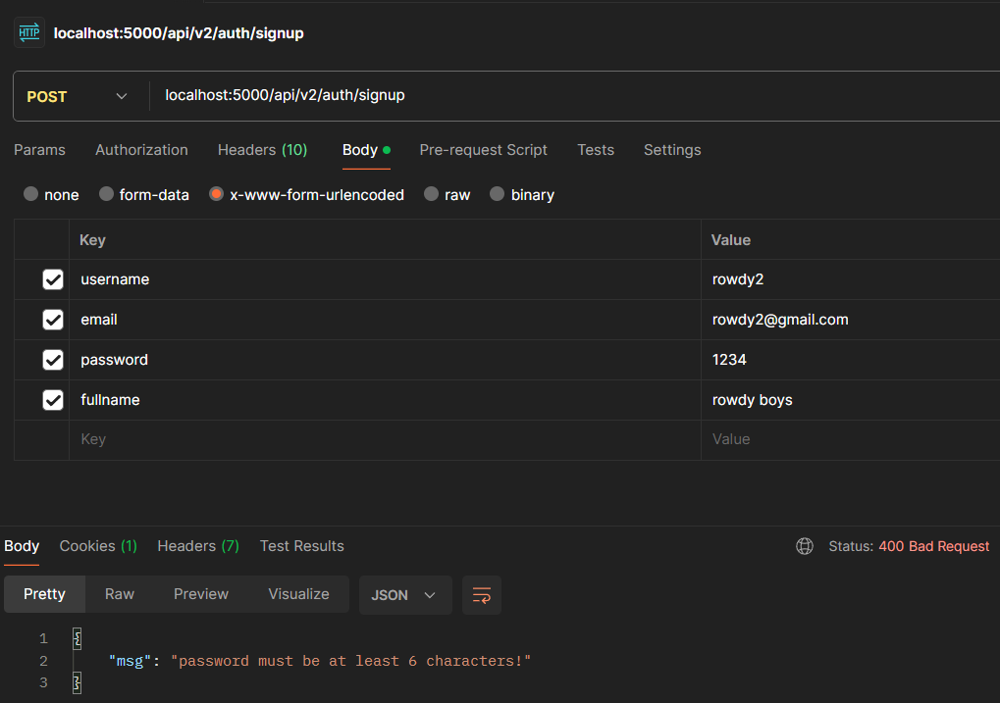</li>
                <li>exists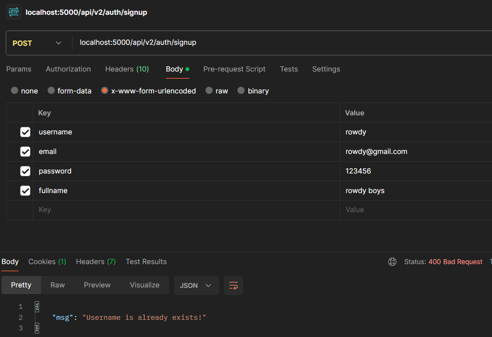</li>
                <li>new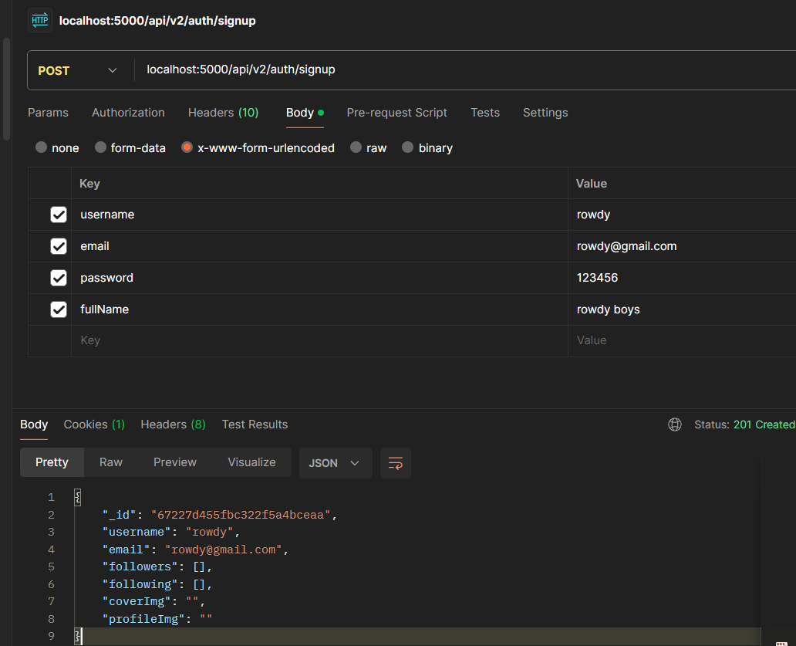</li>
            </ul>
        </li>
    <!-- login -->
    <li>
        Login
            <ul>
                <li>username incorrect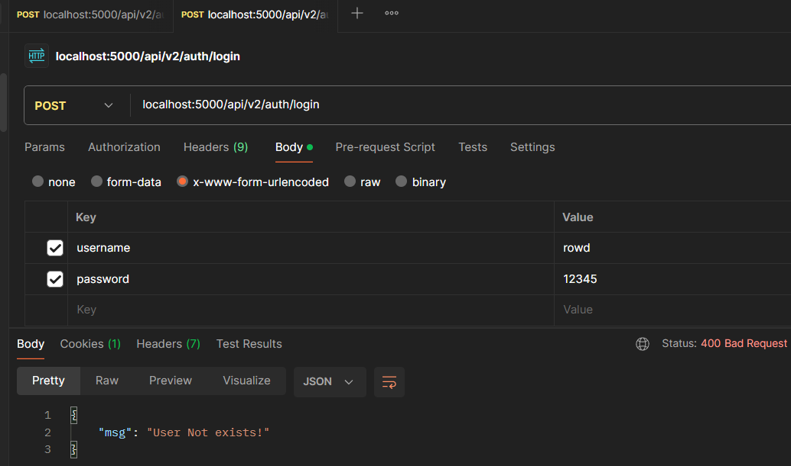</li>
                <li>username/pass incorrect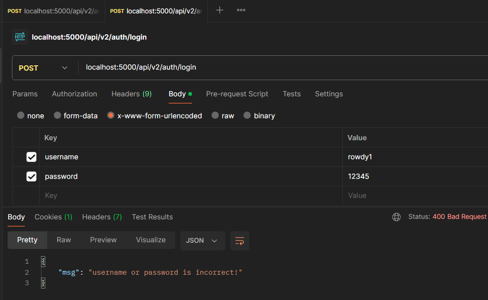</li>
                <li>login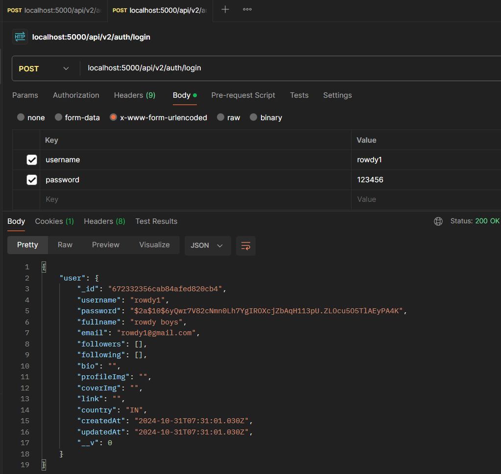</li>
                <li>jwt code in cookie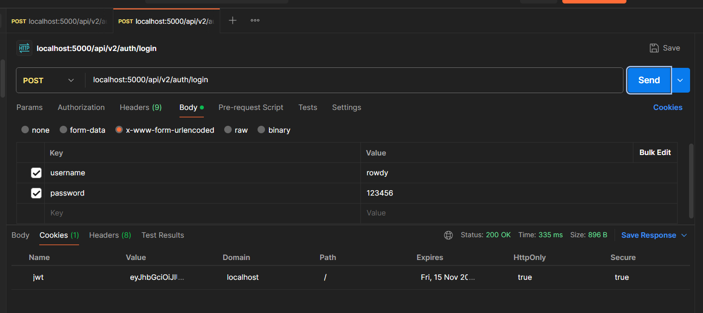</li>
            </ul>
        </li>  
    <!-- logout -->
    <li>
        Logout
            <ul>
                <li>logout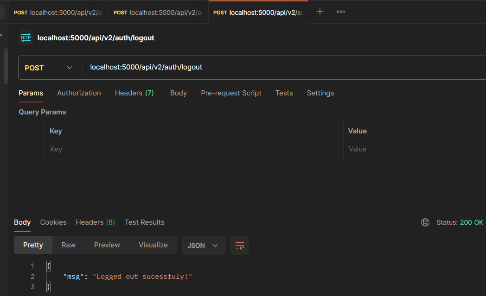</li>
                <li>jwt code in cookie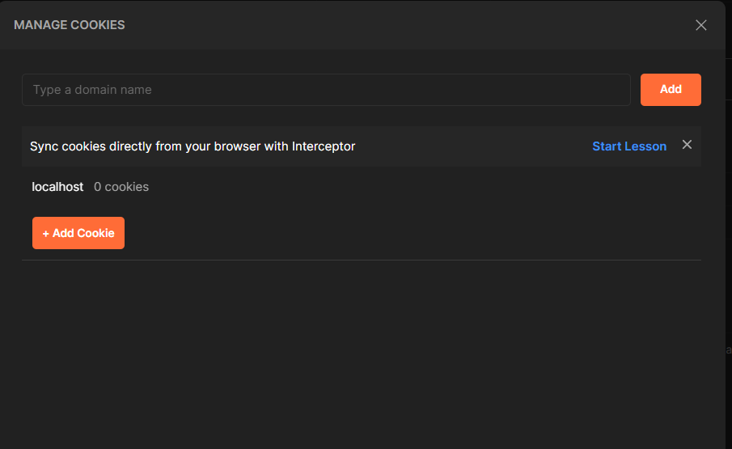</li>
            </ul>
        </li>
    <!-- get user data only if his/her session is valid -->
    <li>
        get user data only if his/her session is valid
            <ul>
                <li>no jwt in cookie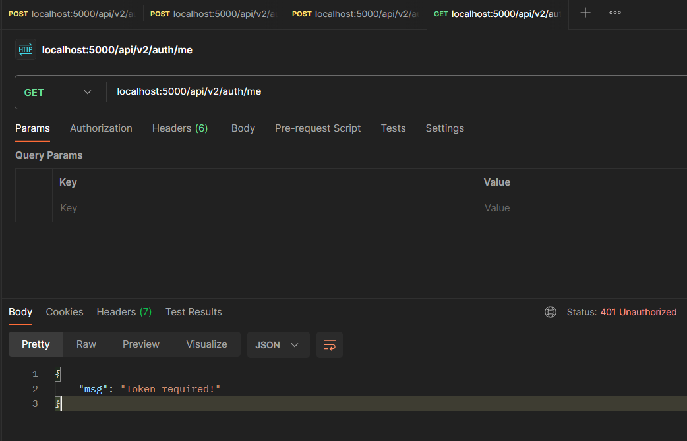</li>
                <li>jwt code in cookie then user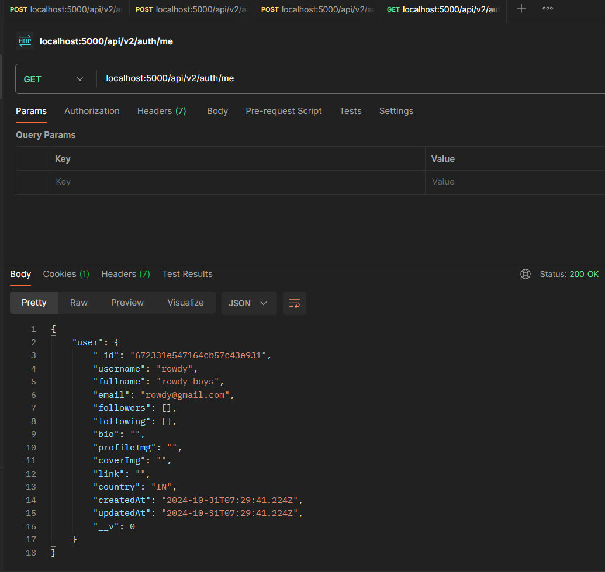</li>
            </ul>
        </li>
    </ul>
    </li>
<!-- user -->
<li>
    USER ROUTERS
    <ul>
    <!-- get user profile -->
        <li>
        get user profile
            <ul>
                <li>if user not logged in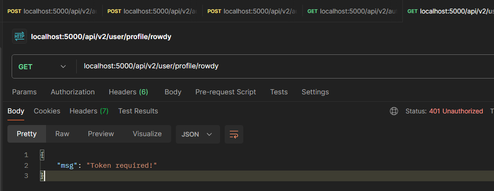</li>
                <li>if user not found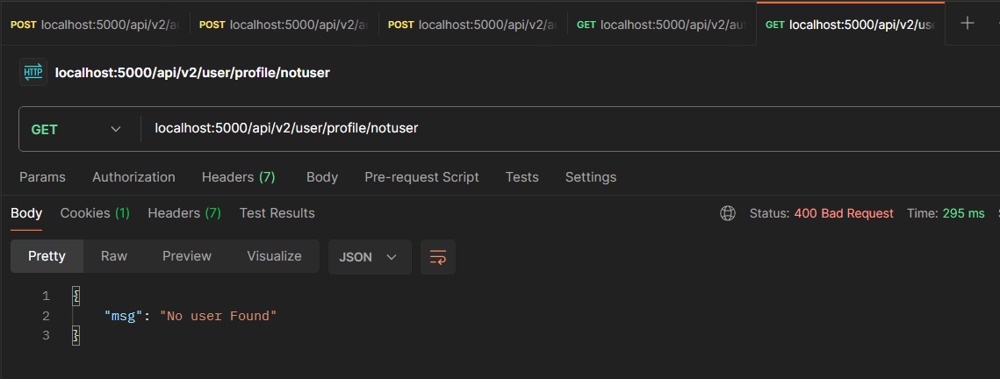</li>
                <li>if user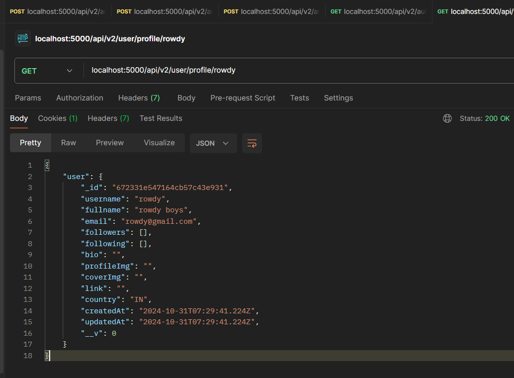</li>
            </ul>
        </li>
        <!-- follow/unfollow -->
         <li>
        follow/unfollow
            <ul>
                <li>if trying to follow self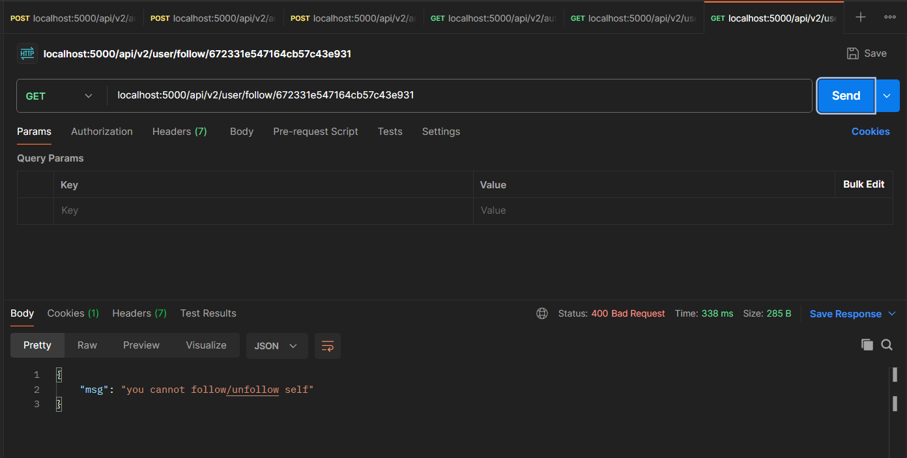</li>
                <li>follow if :id is not include in current user array 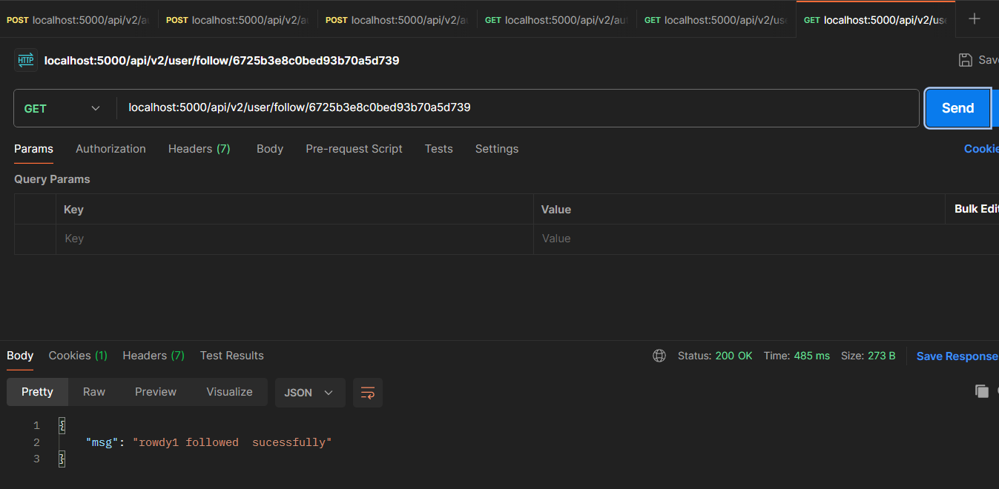</li>
                <li>unfollow if :id is include in current user array 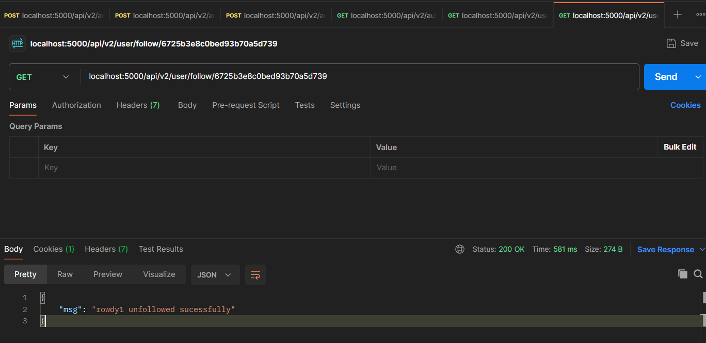</li>
            </ul>
        </li>
        <!-- notification -->
         <li>
        notification
            <ul>
                <li>notification update </li>
            </ul>
        </li>
    </ul>
</ul>
