

    Twitter Clone Using MERN

<ul>
<!-- auth -->
    <li>
    AUTH ROUTERS
    <ul>
    <!-- signup -->
        <li>
        Signup
            <ul>
                <li>password</li>
                <li>exists</li>
                <li>new</li>
            </ul>
        </li>
    <!-- login -->
    <li>
        Login
            <ul>
                <li>username incorrect</li>
                <li>username/pass incorrect</li>
                <li>login</li>
                <li>jwt code in cookie</li>
            </ul>
        </li>  
    <!-- logout -->
    <li>
        Logout
            <ul>
                <li>logout</li>
                <li>jwt code in cookie</li>
            </ul>
        </li>
    <!-- get user data only if his/her session is valid -->
    <li>
        get user data only if his/her session is valid
            <ul>
                <li>no jwt in cookie</li>
                <li>jwt code in cookie then user</li>
            </ul>
        </li>
    </ul>
    </li>
<!-- user -->
<li>
    USER ROUTERS
    <ul>
    <!-- get user profile -->
        <li>
        get user profile
            <ul>
                <li>if user not logged in</li>
                <li>if user not found</li>
                <li>if user</li>
            </ul>
        </li>
        <!-- follow/unfollow -->
         <li>
        follow/unfollow
            <ul>
                <li>if trying to follow self</li>
                <li>follow if :id is not include in current user array </li>
                <li>unfollow if :id is include in current user array </li>
            </ul>
        </li>
        <!-- notification -->
         <li>
        notification
            <ul>
                <li>notification update 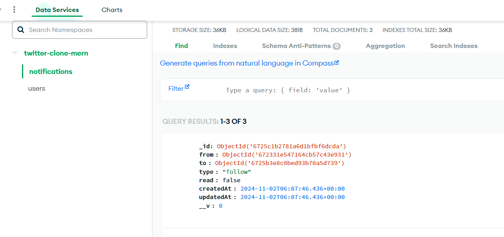</li>
            </ul>
        </li> 
        <!-- suggetions -->
         <li>
        suggetions
            <ul>
                <li>if followed 
                    <ul>
                        <li>if followed someone 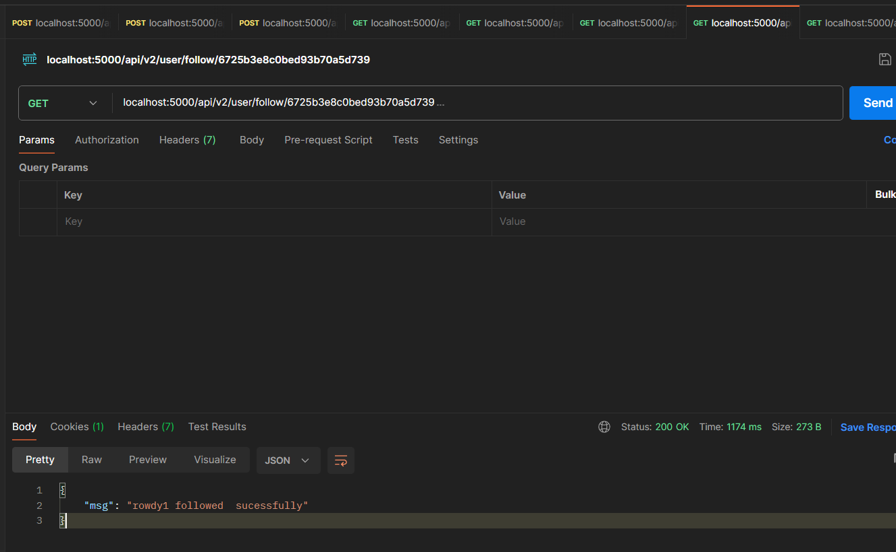</li>
                        <li>then not suggest that user 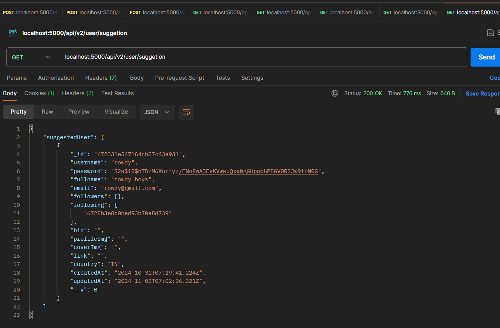</li>
                    </ul>
                </li>
                <li>if *not followed 
                    <ul>
                        <li>if not followed someone 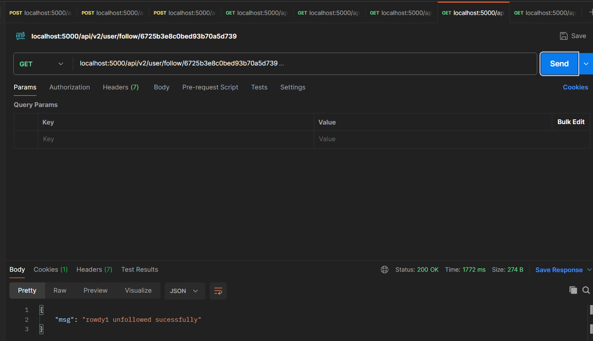</li>
                        <li>then getting suggestion of that user 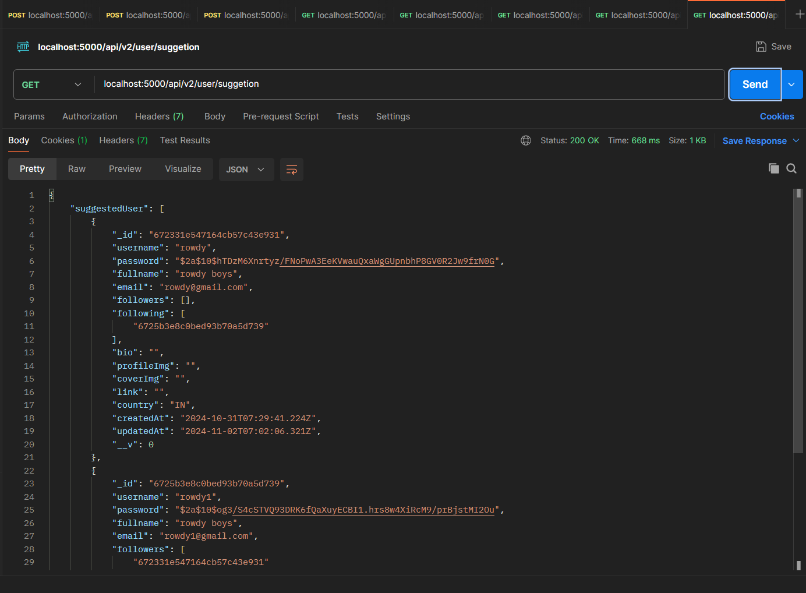</li>
                    </ul>
                </li>
            </ul>
        </li>
        <!-- update profile  -->
           <li>
        update profile 
            <ul>
                <li>before profile update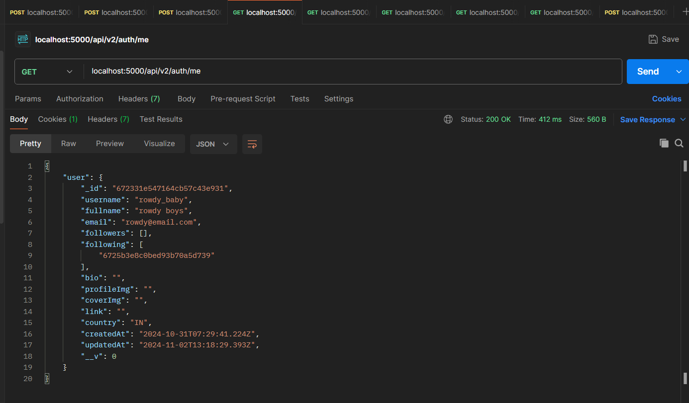</li>
                <li>update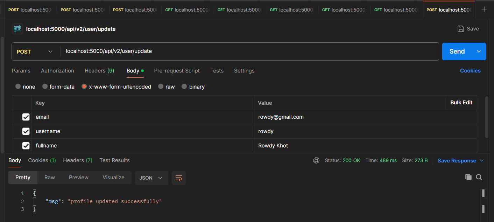</li>
                <li>after profile update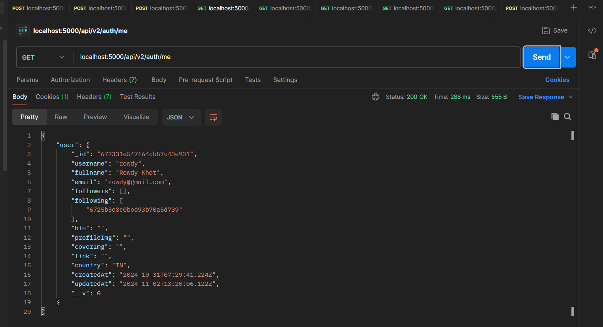</li>
            </ul>
        </li> 
        <!-- update password -->
         <li>
        update password 
            <ul>
                <li>only passing update password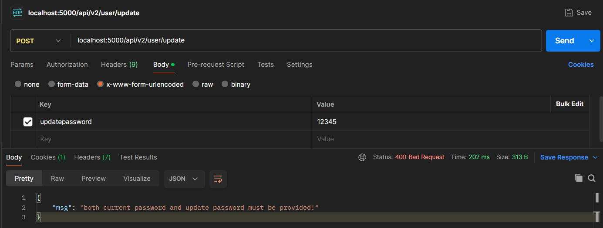</li>
                <li>passing new password less than 6 char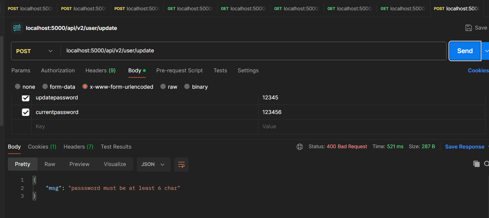</li>
                <li>passing current password as wrong one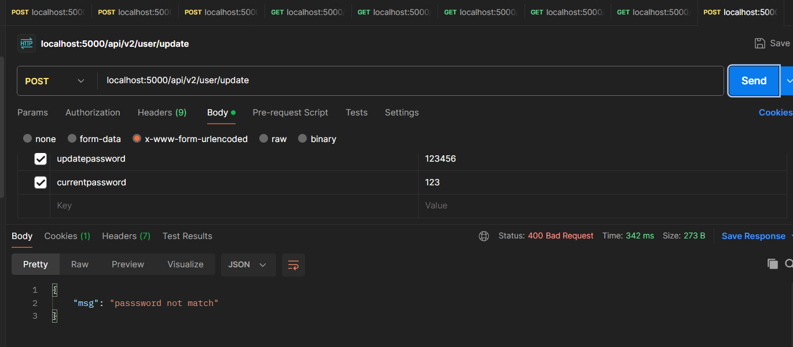</li>
                <li>passing new password same as before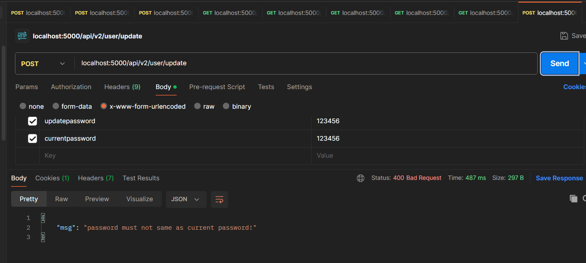</li>
                <li>evrything ok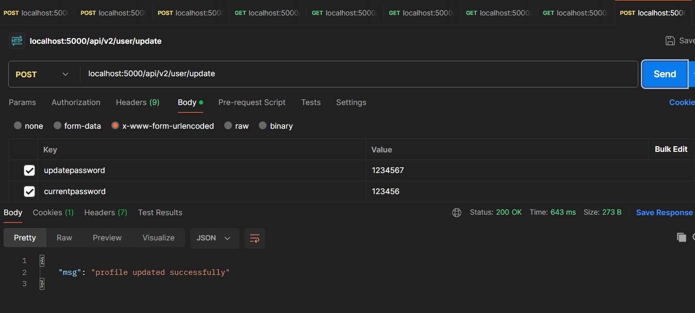</li>
                <li>now test login with old password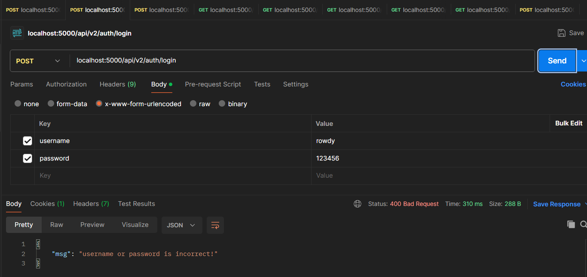</li>
                <li>now test login with updated password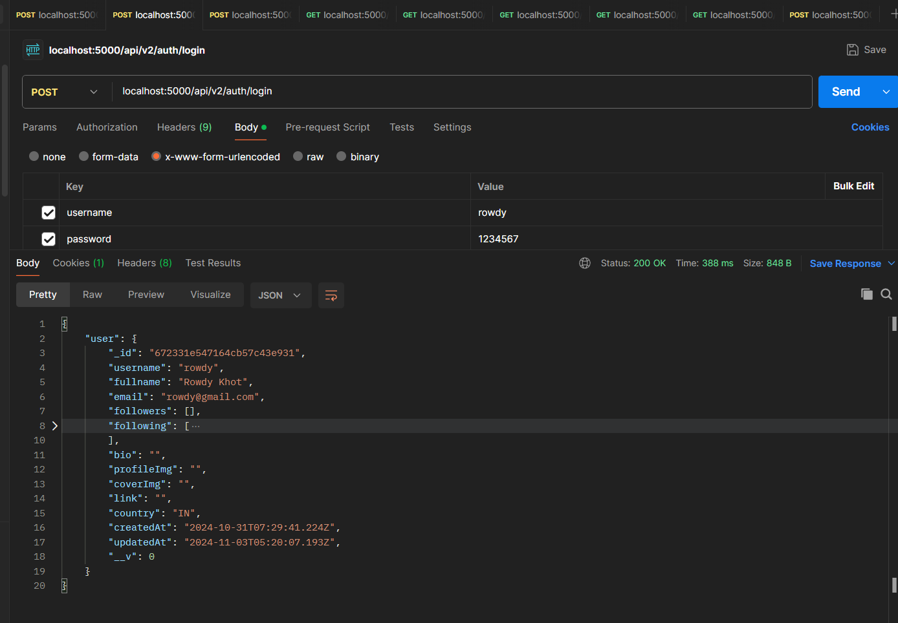</li>
            </ul>
        </li> 
    </ul>
    <!-- posts -->
    <li>
    Post Routers
        <ul>
        <!-- create new post -->
            <li>
            create new post 
                <ul>
                    <li>if post is blank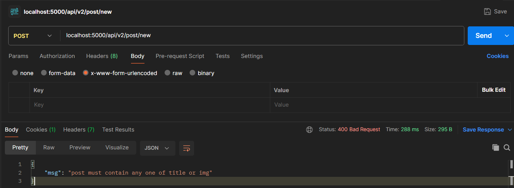</li>
                    <li>if post contains data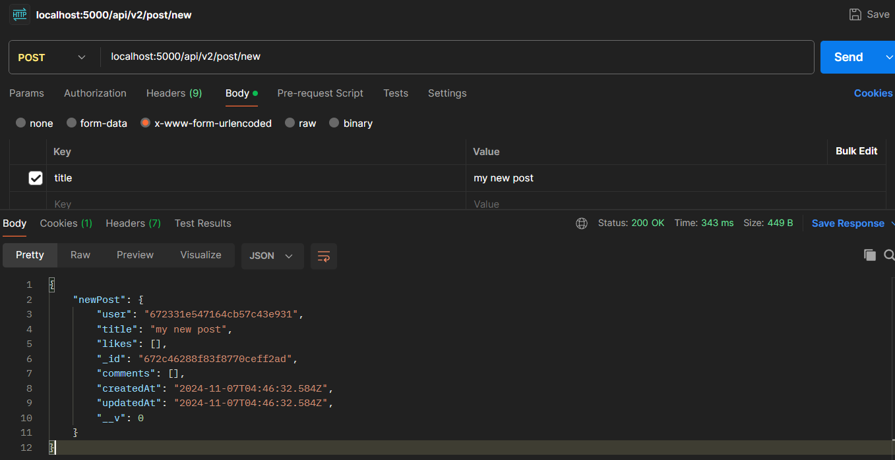</li>
                    <li>db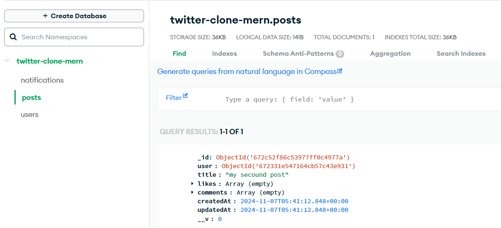</li>
                    </ul>
            </li>
        <!-- delete a post -->
        <li>
            delete a post 
                <ul>
                    <li>all posts in db</li>
                    <li>if post not exists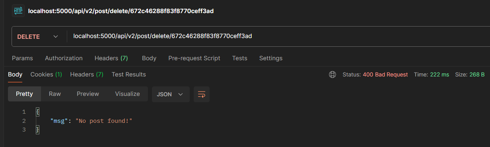</li>
                    <li>if there then delete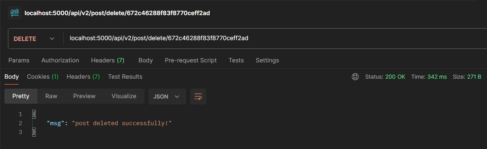</li>
                    <li>after delete db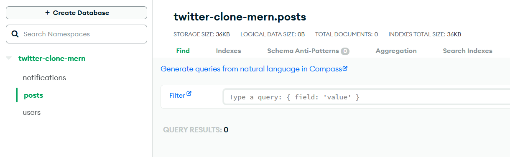</li>
                    </ul>
            </li>
        </ul>
    </li>
</ul>
