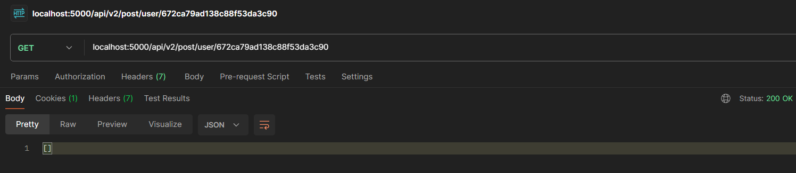
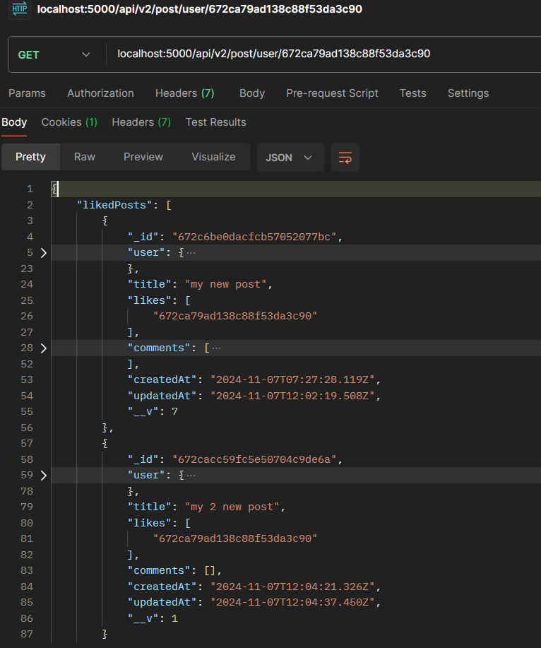

### Twitter Clone Using MERN

## Table 

<table>
    <tr>
        <td>1.</td>
        <td>

[Authentication Routes](#authentication-routes)
        </td>
    </tr>
    <tr>
        <td>2.</td>
        <td>

[User Routes](#user-routes)
        </td>
    </tr>
    <tr>
        <td>3.</td>
        <td>

[Post Routes](#post-routes)
        </td>
    </tr>
</table>

<!--! auth -->
### Authentication Routes

   <ul>
    <!-- signup -->
        <li>
        1. Signup
            <ul>
                <li>password must be 6 characters</li> 

                <li>if username already exists</li> 

                <li>new username then</li>
            </ul>
        

        </li>
    <!-- login -->
    <li>
       2.  Login
            <ul>
                <li>username incorrect</li> 

                <li>username/pass incorrect</li> 

                <li>login if all okay</li> 

                <li>jwt code in cookie</li> 
            </ul>
        </li> 
        
  
    <!-- logout -->
    <li>
       3. Logout
            <ul>
                <li>logout</li> 

                <li>jwt code in cookie</li>
            </ul>
        </li> 
        

    <!-- get user data only if his/her session is valid -->
    <li>
       4. get user data only if his/her session is valid
            <ul>
                <li>no jwt in cookie</li> 

                <li>jwt code in cookie then user</li> 
            </ul>
    </li>
    

<!--! user -->
### User Routes
<ul>
    <!-- get user profile -->
        <li>
        1. get user profile
            <ul>
                <li>if user not logged in</li> 

                <li>if user not found</li> 

                <li>if user</li> 
            </ul>
        </li>
        

        <!-- follow/unfollow -->
         <li>
        2. follow/unfollow
            <ul>
                <li>if trying to follow self</li> 

                <li>follow if :id is not include in current user array </li> 

                <li>unfollow if :id is include in current user array </li>
            </ul>
        </li> 
        

        <!-- notification -->
         <li>
        3. notification
            <ul>
                <li>notification update </li>
            </ul>
        </li>
        
 
        <!-- suggetions -->
         <li>
        4. suggetions
            <ul>
                <li>if followed 
                    <ul>
                        <li>if followed someone </li> 

                        <li>then not suggest that user </li>
                    </ul>
                </li>
                

                <li>if *not followed 
                    <ul>
                        <li>if not followed someone </li> 

                        <li>then getting suggestion of that user </li>
                    </ul>
                </li>
            </ul>
        </li>
        

        <!-- update profile  -->
           <li>
        5. update profile 
            <ul>
                <li>before profile update</li> 

                <li>update</li> 

                <li>after profile update</li>
            </ul>
        </li>
        
 
        <!-- update password -->
         <li>
        6. update password 
            <ul>
                <li>only passing update password</li> 

                <li>passing new password less than 6 char</li> 

                <li>passing current password as wrong one</li> 

                <li>passing new password same as before</li> 

                <li>evrything ok</li> 

                <li>now test login with old password</li> 

                <li>now test login with updated password</li>
            </ul>
        </li>
        
 
    </ul>
    
<!--! posts -->

### Post Routes
<ul>
        <!-- create new post -->
            <li>
            1. create new post 
                <ul>
                    <li>if post is blank</li> 

                    <li>if post contains data</li> 

                    <li>db</li>
                    </ul>
            </li> 
            

        <!-- delete a post -->
        <li>
            2. delete a post 
                <ul>
                    <li>all posts in db</li> 

                    <li>if post not exists</li> 

                    <li>if there then delete</li> 

                    <li>after delete db</li> 
                </ul>
            </li>
            

        <!-- comment on a post -->
        <li>
            3. comment on a post 
                <ul>
                    <li>if post not exists</li> 

                    <li>if there then comment</li> 

                    <li>comment having text empty</li> 

                    <li>after comment db</li>
                </ul>
            </li> 
            

        <!-- like or unlike -->
        <li>
            4. like or unlike 
                <ul>
                    <li>like a post if likes array not include current logged in user id in them</li> 

                    <li>db after like</li> 

                    <li>create a *notification after a like</li> 

                    <li>unlike a post if likes array includes current logged in user id in them</li> 

                    <li>delete a *notification after a unlike the same post</li> 

                    <li>db after unlike</li>
                </ul>
            </li> 
            

            <!-- get all posts -->
            <li>5. get all posts 
            <ul>
                 <li>treditional way</li> 

                 <li>best way to populate user detials in comments and post
                 <pre>
                 ### this one line of code solve problem ###
 const posts = await Post.find({}).sort({ createdAt: -1 }).populate({
            path: 'user',
            select: '-password'
        }).populate({
            path: 'comments.user',
            select: "-password"
        });
                 </pre>
                 </li> 
                 

            </ul>
            </li>
            <!-- liked post by user -->
            <li>liked post by user
             <ul>
             <li>changing user model with refrence to post model
             <pre>
liked: [
    {
        type: mongoose.Schema.Types.ObjectId,
        ref: 'Post',
        default: []
    }
]
             </pre>
             

             </li>
                    <li>if user is new</li> 

                    <li>if user liked two posts(also populating user and post details by using post id itself)</li>
                    

                    <li>cross checking me endpoint</li>
                </ul>
            </li>
        </ul>

### 
